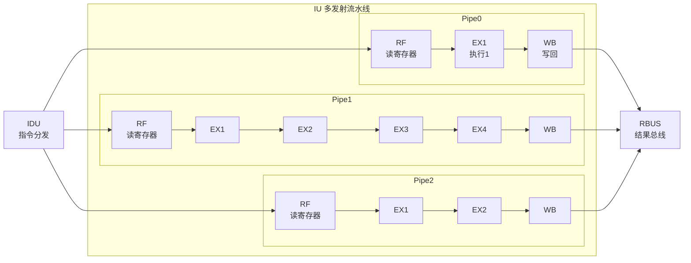
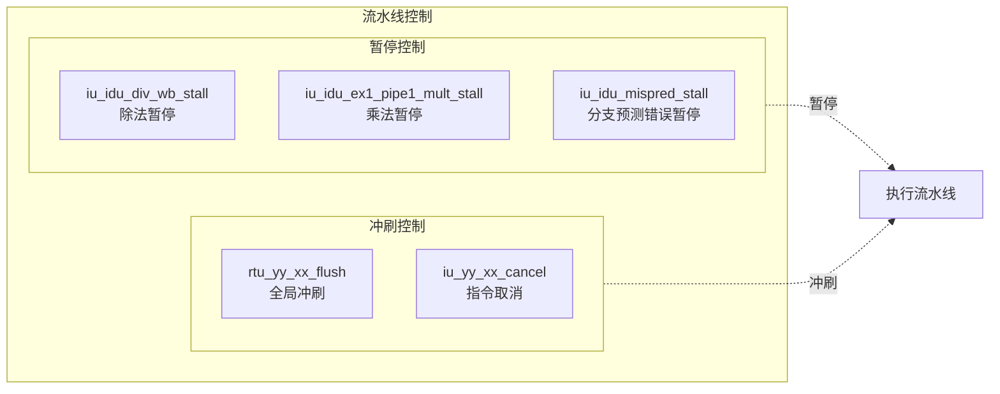
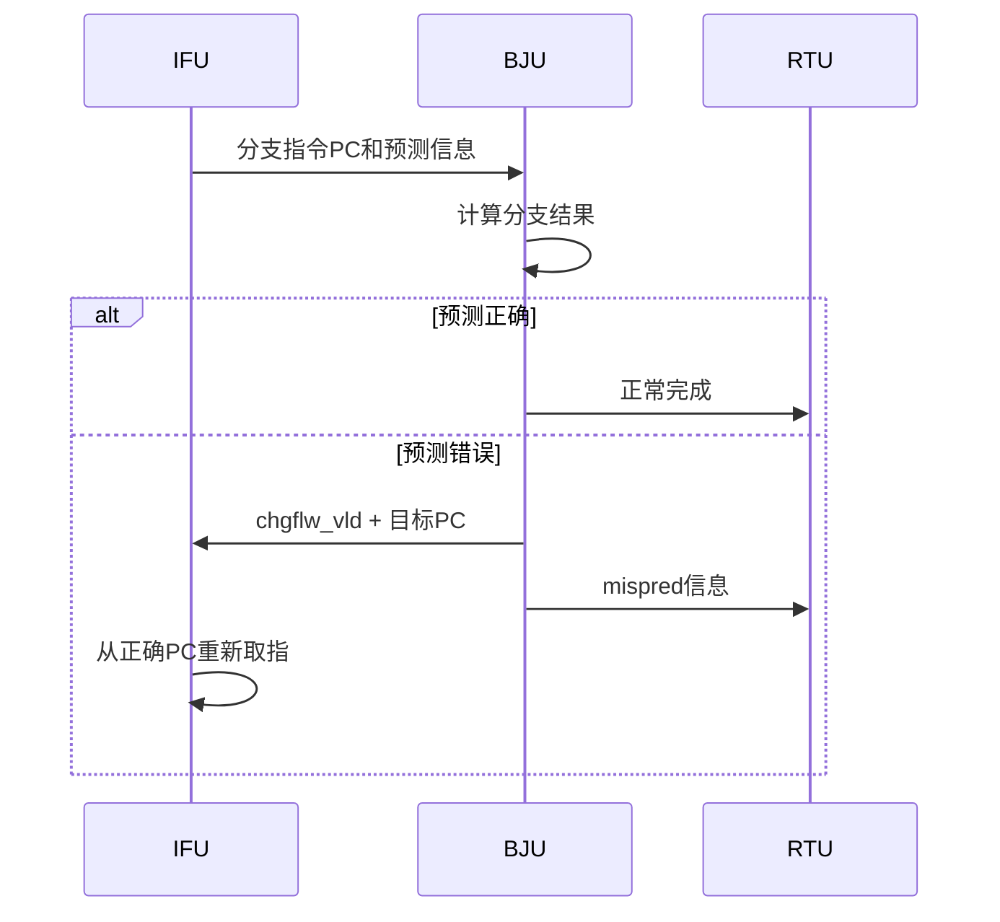

# ct_iu_top 流水线图

## 1. 流水线概述

ct_iu_top 采用多发射乱序执行架构，包含三条独立的执行流水线：

| 流水线 | 执行单元 | 级数 | 支持指令 |
|--------|----------|------|----------|
| Pipe0 | ALU0, DIV, SPECIAL | 2-多周期 | 简单ALU、除法、特殊指令 |
| Pipe1 | ALU1, MULT | 4 | ALU、乘法 |
| Pipe2 | BJU | 2 | 分支跳转指令 |

## 2. 流水线结构图



## 3. 各流水线详细说明

### 3.1 Pipe0 - 主执行流水线

```
RF → EX1 → WB
```

| 阶段 | 说明 | 周期数 |
|------|------|--------|
| RF | 寄存器读取、操作数前递 | 1 |
| EX1 | ALU计算、除法迭代 | 1~64 |
| WB | 结果写回 | 1 |

**执行单元分配：**
- **ALU0**: 简单算术逻辑运算 (ADD, SUB, AND, OR, XOR, SLL, SRL等)
- **DIV**: 除法运算 (DIV, DIVU, REM, REMU) - 迭代执行
- **SPECIAL**: 特殊指令 (ECALL, EBREAK, AUIPC, VSETVL等)

### 3.2 Pipe1 - 乘法/ALU流水线

```
RF → EX1 → EX2 → EX3 → EX4 → WB
```

| 阶段 | 说明 | 周期数 |
|------|------|--------|
| RF | 寄存器读取、操作数前递 | 1 |
| EX1 | 乘法第一级、ALU计算 | 1 |
| EX2 | 乘法第二级 | 1 |
| EX3 | 乘法第三级 | 1 |
| EX4 | 乘法结果合并 | 1 |
| WB | 结果写回 | 1 |

**执行单元分配：**
- **ALU1**: 算术逻辑运算 (与ALU0功能相同)
- **MULT**: 乘法运算 (MUL, MULH, MULHSU, MULHU, MULW等)

### 3.3 Pipe2 - 分支流水线

```
RF → EX1 → EX2 → WB
```

| 阶段 | 说明 | 周期数 |
|------|------|--------|
| RF | 寄存器读取、PC FIFO管理 | 1 |
| EX1 | 分支条件计算 | 1 |
| EX2 | 分支目标计算、预测验证 | 1 |
| WB | 结果写回、分支修正 | 1 |

**执行单元：**
- **BJU**: 分支跳转指令 (BEQ, BNE, BLT, BGE, JAL, JALR等)

## 4. 流水线控制信号



## 5. 数据前递机制

| 前递路径 | 源阶段 | 目标阶段 | 说明 |
|----------|--------|----------|------|
| ALU Forward | EX1 | RF | ALU结果前递 |
| MULT Forward | EX2/EX3/EX4 | RF | 乘法中间结果前递 |
| DIV Forward | WB | RF | 除法结果前递 |
| MFVR Forward | EX2 | RF | 向量寄存器数据前递 |

## 6. PC FIFO 机制

BJU 使用 PC FIFO 管理分支指令的 PC 信息：

| 信号 | 说明 |
|------|------|
| ifu_iu_pcfifo_create0_en | 创建入口0 |
| ifu_iu_pcfifo_create1_en | 创建入口1 |
| iu_ifu_pcfifo_full | FIFO 满标志 |
| iu_rtu_pcfifo_pop*_data | 退休时弹出数据 |

## 7. 分支预测验证


